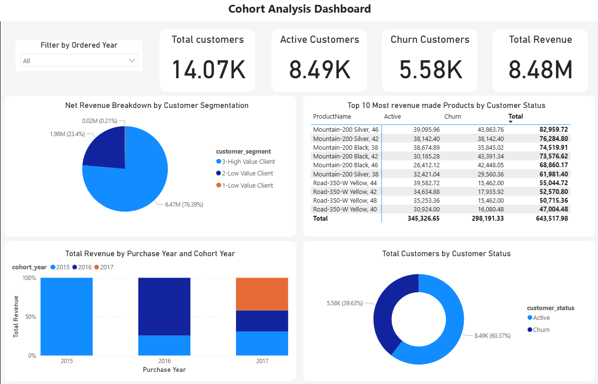

# 📊 Customer Cohort & Segmentation Analytics Dashboard

This repository contains a SQL-powered dashboard analysis that uncovers critical insights about customer behavior, revenue generation patterns, and business health through **Cohort Analysis**, **Customer Segmentation**, and **Churn Rate Evaluation**.

## 📌 Project Overview

The dashboard visualizes customer trends using real transactional data. It answers key business questions such as:

- How many customers are active vs. churned?
- Which customer segments generate the most revenue?
- What is the revenue trend over cohorts?
- What are the top-performing products by customer status?

All analytics are executed using **SQL views, CTEs, and window functions**, then visualized in a clear and concise dashboard interface.

---

## 🧠 Insights & Key Highlights

### 🎯 Total Metrics

| Metric               | Value     |
|----------------------|-----------|
| Total Customers      | 14,070    |
| Active Customers     | 8,490     |
| Churned Customers    | 5,580     |
| Total Revenue        | $8.48M    |

---

## 🧩 Analysis Modules

### 1. 📅 **Cohort Revenue Analysis**

Defined cohorts based on each customer's first purchase year, and tracked their revenue generation across subsequent years.

**SQL Logic:**
- Created a `client_revenue` view by calculating net revenue per product per order.
- Assigned cohort years based on first purchase dates.
- Aggregated revenue by `cohort_year` vs. `purchase_year`.

**Insight:**
> Customers acquired in 2015 contributed a higher and more consistent revenue stream over the next two years compared to newer cohorts. Retention and loyalty strategies were likely more effective for earlier cohorts.

---

### 2. 🧮 **Customer Segmentation by Revenue**

Segmented customers into three buckets based on revenue contribution:
- **High Value Clients (Top 25%)**
- **Low Value Clients (Middle 50%)**
- **Very Low Value Clients (Bottom 25%)**

**SQL Logic:**
- Used `percentile_cont()` to find 25th and 75th percentiles.
- Assigned segment labels using conditional logic.

**Insight:**
> 76.4% of revenue came from High Value Clients. A very small portion (0.21%) came from Very Low Value Clients, suggesting a potential to either re-engage or filter out unproductive users.

---

### 3. 🔁 **Active vs. Churn Analysis**

Classified customer status based on last purchase:
- **Active**: Purchased within the last 6 months.
- **Churned**: No purchases in over 6 months.

**SQL Logic:**
- Identified most recent purchase per customer.
- Compared against reference date using `DATEADD()`.

**Insight:**
> 60.37% of customers are still active. However, a notable churn rate (39.63%) suggests room for reactivation campaigns.

---

## 📦 Data Models & Views

- `client_revenue`: Calculates net profit per order per customer.
- `cohort_analysis`: Aggregates revenue by cohort and purchase year.
- `customer_segmentation`: Classifies customers by net revenue quartiles.
- `churndate`: Identifies active vs. churned customers.

---

## 📊 Dashboard Components

| Visualization                             | Purpose |
|------------------------------------------|---------|
| **KPI Cards**                             | Show total customers, revenue, churn stats |
| **Pie Charts**                            | Customer status distribution, Segmentation breakdown |
| **Stacked Column Chart**                  | Revenue over time by cohort year |
| **Top Products Table**                    | Revenue from top-selling products by status |

---

